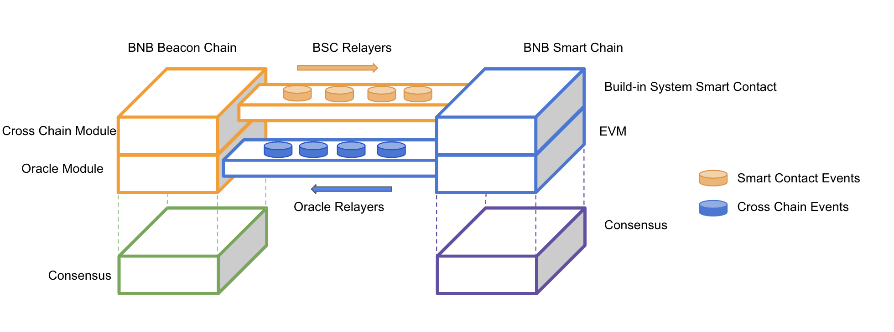

# 크로스체인 커뮤니케이션

BC (비콘 체인)과 BSC (BNB 스마트체인) 사이에 네이티브 크로스체인 커뮤니케이션 프로토콜이 개발되었습니다. 주요 요소는 다음과 같습니다:

* [Build-in System Contract](system-contract.md)
* [비콘 체인 오라클](oracle-module.md)
* [BSC 릴레이어](bsc-relayer.md)
* [BSC 릴레이어 인센티브 메커니즘](incentives.md)
* [오라클 릴레이어](oracle-relayer.md)

## Architecture Diagram
The following diagram depicts the architecture of the cross-transfer mechanism.

