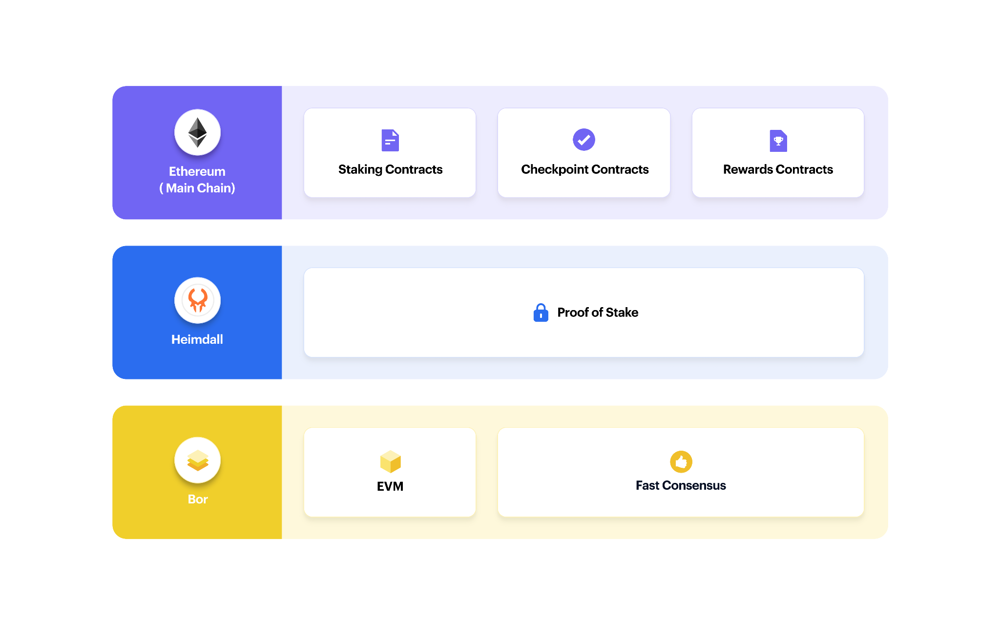
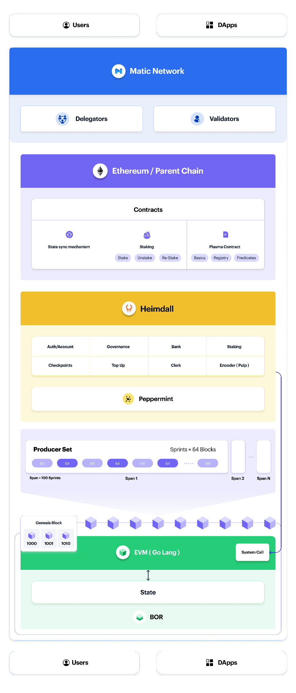

# BNB 스마트 체인 vs 폴리곤 - 차이점 비교

BNB 체인은 2020년에 출범하여 빠른 시간 안에 적은 수수료와 빠른 전송률을 토대로 많은 인기를 얻었습니다. 다른 블록체인 플랫폼에 있는 몇몇 프로젝트들은 BNB 체인 플랫폼으로 이전하고 있습니다. 이 문서에서는 BNB체인과 다른 EVM 체인과의 비교와 다른 EVM 체인에서 BNB 체인으로 이전하는 방법에 대해 다룹니다.

### 이더리움 가상 머신(EVM)
EVM은 이더리움 가상 머신을 의미합니다. 더 간단히 말하자면 EVM은 이더리움의 가상 CPU로 스마트 컨트랙트의 바이트 코드를 실행합니다. 
이더리움은 스마트 컨트랙트 프로그래밍이 가능한 퍼블릭 블록체인의 선구자로 여겨집니다. 다만 시간이 지나면서 느리고 비싼 트랜잭션과 네트워크 포화로 인해 더 싸고 빠른 트랜잭션을 제공하면서도 EVM이 호환되는 대안들이 출시되기 시작했습니다.
EVM 호환성은 블록체인 상호 운용성을 달성하는 주춧돌이라고 생각할 수 있습니다. EVM 호환성은 EVM에서 실행 가능한 코드와 유사한 코드를 실행할 수 있는 환경을 만들어 이더리움 개발자들이 이더리움 호환 체인에 코드를 처음부터 작성할 필요 없이 쉽게 옮길 수 있도록 지원하는 것을 뜻합니다. 따라서 개발자들은 쉽게 이더리움 체인에서 BSC 혹은 다른 EVM 호환 체인으로 디앱을 이전할 수 있습니다. 대표적인 EVM에는 BSC, 폴리곤, 아발란체 등이 있습니다.

### BNB 체인
BNB 체인은 두 개의 블록체인 거인인 비컨 체인(BC)과 BNB 스마트 체인으로 구성되어 있습니다. 비컨 체인은 BNB 체인의 거버넌스(스테이킹, 투표)를 담당하고 2020에 만들어진 BNB 체인은 EVM이 호환되고, 합의 레이어가 존재하며 멀티 체인을 지원합니다.
BSC는 이더리움의 하드포크를 개선한 것이며 비컨 체인과 병렬적으로 운영됩니다. 이를 통해 BNB 체인 생태계에서 디파이, 게이밍, 소셜 및 다른 디앱들을 생성하기 위한 스마트 컨트랙트 기능을 지원합니다. BSC는 이더리움의 높은 가스비와 확장성 문제를 갖는 것에 비해 낮은 가스비와 빠른 완결성을 통해 2021 전반기에 실질적인 인기를 얻게 되었습니다.

### 폴리곤 
이전에는 Matic으로 알려진 폴리곤(Polygon)은 이더리움 블록체인의 레이어 2 스케일링 솔루션입니다. 사이드 체인을 통해 이더리움 네트워크 수준의 탈중앙성 및 보안을 달성하면서 이더리움의 문제점을 해결합니다. 폴리곤은 사실상 초당 트랜잭션 속도(TPS)를 높여 이더리움 블록체인의 확장성 및 합의 알고리즘 관련된 문제를 해결합니다.

## Comparing BSC and Polygon
이 부분에서는 이 두 플랫폼을 여러 요소를 토대로 비교해 보겠습니다. 
혁신
BSC는 이더리움의 개선한 버전으로 권한증명(PoA)과 위임지분증명(DPoS)의 장점을 합친 권한지분증명(PoSA) 합의 알고리즘을 사용합니다. 반면 폴리곤은 이더리움의 레이어 2 사이드체인으로 플라즈마 프레임워크와 지분증명(PoS) 체인을 사용하여 자산의 보안을 유지합니다. 폴리곤은 이더리움 호환 블록체인을 구축하기 위한 상호 운용 가능한 스케일링 프레임워크입니다. BSC는 최근 Zk롤업을 발표 했으며 폴리곤도 향후 출시를 목표로 하고 있습니다. 

이더리움과의 관계 
폴리곤은 사이드 체인을 통해 연산을 하기 위한 레이어 2 솔루선에 해당되어, 이더리움의 커밋 체인(Commit chain)이라고 생각할 수 있습니다. 이 뜻은 폴리곤의 최종 트랜잭션이 이더리움 상에서 이루어져서 이더리움이 없으면 작동할 수 없습니다. 현재 폴리곤은 지분증명(Proof of Stake)알고리즘을 사용하지만, Zk 롤업으로 변화하여 현재 탈중앙화가 부족하다는 비판을 극복하려고 합니다. 
반면 BSC는 이더리움의 하드 포크로 만들어졌습니다. BSC는 개별 레이어 1 블록체인으로 이더리움 네트워크가 없어도 자체적으로 작동 가능합니다.

### EVM 호환성
EVM 지원은 BSC, 폴리곤, 이더리움 간 상호운용이 가능해집니다. 따라서 개발자들은 이더리움 네트워크에서 폴리곤 혹은 BSC 또는 그 반대로 디앱을 편하게 이전할 수 있습니다.

### 아키텍처

#### BSC 아키텍처 개요
BNB 체인은 비컨 체인(BC)과 BNB 스마트 체인(BSC)라는 서로 다른 목적을 가진 두 가지의 블록체인으로 구성된 생태계입니다. 증가한 일일활성사용자(DAU)와 트랜잭션을 처리하기 위해, BNB 체인 생태계는 스케일링 솔루션을 추가할 수 있도록 진화하였고 다음과 같은 다양한 목적을 지닌 컴포논트를 갖게 되었습니다.
- [**BNB 비컨 체인**](https://docs.bnbchain.org/docs/learn/beaconIntro) - BNB 체인 거버넌스 (스테이킹, 투표)
- [**BNB 스마트 체인 (BSC)**](https://docs.bnbchain.org/docs/learn/intro) - EVM 호환, 합의 레이어, 멀티 체인 허브
- [**BNB 사이드 체인**](https://docs.bnbchain.org/docs/BNBSidechain/overview/bs-overview) -현존하는 BSC 기능을 사용 가능한 자체 블록체인 및 디앱을 개발 할 수 있는 PoS 솔루션
- **BNB Zk롤업**- BSC를 스케일링 및 고성능 블록체인으로 만드는 Zk롤업 솔루션
 

**BSC**의 디자인 정의:
* **독립형 블록체인**: BSC가 비컨 체인과 함께 작동하긴 하지만 엄밀히 말하자면 독립형 블록체인입니다. BSC의 가장 중요한 기술적 비즈니스적인 기능들은 내제화 되어 있어, 비컨 체인이 멈추더라도 정상적으로 작동합니다.
* **이더리움 호환성**: 상대적으로 성숙한 어플리케이션들이나 커뮤니티를 가진 이더리움의 장점을 활용하기 위해, BSC는 현존하는 이더리움 메인넷과 호환할 수 있도록 설계하였습니다. 이는 대부분의 이더리움 기반 **디앱**들과, 생태계 컴포넌트, 도구등을 조금 혹은 아예 변경하지 않아도 사용할 수 있다는 것을 뜻합니다. 또한, BSC 노드들은 이더리움 노드들을 작동할 때 필요한 하드웨어 스펙 및 지식을 가지고 있으면 노드를 운영할 수 있습니다.
* **스테이킹 관여된 합의 및 거버넌스**: 스테이킹 기반 합의는 환경 친화적이며 더욱 유연한 커뮤니티 거버넌스를 가능하게 합니다. 다음 합의 체계는 작업 증명 블록체인 시스템 보다 더 빠른 블록 시간과 트랜잭션 수용량을 통해 더 나은 네트워크 성능을 지원합니다.
* **자체 크로스 체인 통신**: both BC와 BSC는 두 블록체인 간 자체 크로스 체인 통신을 지원합니다. 통신 프로토콜은 양방향이며, 탈중앙화 되었으며, 신뢰 없이 작동하도록 설계되었습니다. 이 기능은 BC와 BSC 간 BEP2나 향후에 지원할 다른 BEP 토큰 같은 디지털 자산을 옮기는데 집중하였습니다.

#### 폴리곤 구조 개요
폴리곤의 구조는 3개의 계층으로 나눌 수 있습니다. 
* ***이더리움 레이어:** 스테이킹, 체크포인팅, 보상 등 이더리움 메인넷에 존재하는 여러 기능들에 대한 컨트랙트로 이루어져 있습니다.
* ***헤임달 레이어:** 이더리움 메인넷과 평행하게 운영되는 지분증명 헤임달 노드로 이루어져 있으며 이더리움 메인넷에 배포된 스테이킹 건트랙트 모니터링과 폴리곤 네트워크의 체크포인트 커밋을 담당합니다. 헤임달은 텐더민트 프로토콜을 기반으로 제작되었습니다.
* ***Bor 레이어:** 헤임달 노드에 의해 섞인 블록을 생성하는 Bor 노드. Bor는 Go 이더리움을 기반으로 만들어졌습니다.

##### 이더리움에서 스테이킹 관리 스마트 컨트랙트
폴리곤에 지분증면 매커니즘을 운영하기 위해 이더리움 메인넷에 스테이킹 관리 컨트랙트들이 적용되었습니다. 스테이킹 컨트랙트는 다음과 같은 기능을 제공합니다:
* 폴리곤 시스템의 검증인으로 참여하기 위해서는 이더리움 메인넷에 존재하는 스테이킹 컨트랙트에 MATIC 토큰을 스테이킹하면 됩니다.
* 폴리곤 네트워크의 상태 변화를 검증하는 것에 대한 스테이킹 보상을 얻습니다.
* 이더리움 메인넷에 체크포인트를 저장합니다.

##### 헤임달(Heimdall - 검증 레이어)
헤임달(Heimdall)은 폴리곤 시스템의 심장으로 부를 수 있습니다. 헤임달은 검증인, 블록 생성자 결정, 주기, 이더리움과 폴리곤 간 상태 동기화 같이 시스템의 주요 요소들을 관리하기 때문입니다. 코스모스 SDK와 포크된 텐터민트 버전인 페퍼민트를 사용합니다. 헤임달이 개조된 코스모스 SDK를 사용해도 기존과 비슷한 패턴을 보입니다.
헤임달 레이어는 검증 레이어라고도 부를 수 있습니다. 이는 Bor에 의해 생성된 블록을 모은 후 머클 트리로 바꾸어 루트 체인의 머클 루트에 입력하는 과정을 수행합니다. 체크포인트는 Bor 사이드 체인의 스냅샷을 주기적으로 촬용하는 것이라고도 볼 수 있습니다. 레이어에서 몇 블록이 생성되는 특정 주기마다 헤임달 레이어의 검증인들은 다음과 같은 작업을 수행합니다.
1.	마지막 체크포인트 이후 모든 블록들을 검증하기.
2.	블록 해시에 대한 머클 트리 생성.
3.	이더리움 메인넷에 머클 루트 해시 발행하기.

#### 체크포인팅
폴리곤 네트워크에서는 다음과 같은 이유고 체크포인트가 중요합니다
1.	루트 체인에 완결성 제공.
2.	자산 인출 시 소각을 증명.

#### 체크포인팅 과정 개요
* 풀의 활성화된 검증인 부분집합이 특정 주기의 블록 생성자로 활동하도록 선정되어 네트워크에서 새로운 블록 생성 및 전파를 책임지게 됩니다.
* 체크포인트는 주어진 어느 기간 사이에 생성된 모든 블록에 대한 머클 루트 해시를 포함합니다. 모든 노드들은 머클 루트 해시를 검증하고 서명을 첨부합니다.
* 검증인 집합에서 선정된 제안자는 특정 체크포인트에 대한 서명을 수집하고 이더리움 메인넷에 적용해야 합니다.
* 블록을 생성하는 것과 체크포인트를 제안하는 것에 대한 책임은 검증인의 전체 풀에 대한 스테이킹 비율에 의존합니다.
  
#### Bor (블록 생성자 레이어 - block producer layer)
Bor는 폴리곤의 사이드 체인 블록 생성자입니다. 이 레이어는 트랜잭션을 수집 후 블록에 배치하는 것을 담당합니다. Bor 블록 생성자는 사실상 검증인의 부분집합으로 헤임달 검증인들이 기존 이더리움 블록 해시들과 주기적으로 섞여서 탈중앙성을 유지합니다. Bor 노드는 사실상 사이드 체인 연산을 담당합니다. 사이드체인 가상 머신은 EVM이 호환되며 기본 Geth에서 합의 알고리즘을 커스텀으로 변화한 것에 해당합니다. 
 

### 합의 알고리즘
폴리곤은 **지분 증명 (PoS)** 합의 알고리즘을 활용하는 방면 BSC는 **권한지분증명 (PoSA)**을 사용합니다. 양쪽 합의 알고리즘 모두 이더리움의 높은 가스비와 느린 트랜잭션 문제를 해결하기 위해 적용되었습니다. 

지분증명(PoS) 합의 알고리즘에서 검증인은 스테이킹으로 네트워크에 더 많이 기여한만큼 선발된 확률이 증가합니다. 반면 **권한지분증명(PoSA)**은 **지분 증명**과 **권한 증명** 합의 매커니즘을 결합한 형태입니다. 

권한지분증명 매커니즘을 통해 BSC는 초기에 **21**개의 검증인을 갖는 네트워크로 시작하였습니다. 현재 BSC는 **44**개의 검증인을 지원하며, **26**개가 활성화 된 검증인입니다. 향후 BSC는 활성화된 검증인을 **41**개까지 늘리고 전체 검증인은 **80-100**로 운영할 계획입니다. 본딩된 스테이킹이 가장 많은 상위 검증인 후보는 활성 검증인 집합에 선정되어 블록을 생성합니다. 이중 서명 감지 및 여러 슬래싱 로직은 보안성, 안정성 및 체인 완결성을 보장합니다. **41개의 활성화 검증인**외에는 **후보**라는 비활성 검증인으로 작동합니다. 비록 선발될 확률은 낮지만 후보들은 선택될 시 블록을 생성하고 BSC 메인넷에 가스비를 청구할 수 있습니다. 활성화된 검증인과 비슷하게, 사용 불가능한 후보들은 슬래싱되지만 그 양은 활성 검증인보다는 적습니다. 극단적인 경우 대부분의 활성화된 41개의 검증인이 공격 받거나 연결이 불가능할 때, 후보 검증인은 비컨 체인에게 스테일 블록에 대해 보고하고 네트워크를 재생하며 활성 검증인을 재투표하도록 제안할 수 있습니다.

반면 폴리곤은 **지분증명 (PoS)** 합의 매커니즘을 _플라즈마/POS 커밋 체인_에서 사용합니다. 합의 과정에 참여하고자 하는 사용자는 MATIC 토큰을 이더리움의 스테이킹 스마트 컨트랙에 예치해야합니다. 스테이킹은 사용자가 과정에 기여하는 것을 나타냅니다. 슬래싱(스테이킹된 자금 제거)은 예치인들이 유효하지 않은 블록이나 트랜잭션이나 잘못 검증된 블록을 제출하는 것을 방지하기 위해 작동합니다. 검증인이 합의 과정에 참여하기 전에 자금을 잃을 가능성을 만드는 것은 네트워크 무결성을 유지하는데 도움이 됩니다.

## 결론
시장에는 다양한 EVM 호환 블록체인이 존재하며, 언뜻 보기에는 모든 블록체인이 동일한 것처럼 보일 수 있지만, 현실은 모든 블록체인이 특정 사용 사례와 보안 및 가용성 요구사항을 모두 충족하도록 만들어졌습니다. 따라서 BSC는 탁월한 성능과 최첨단 보안을 보장하기 위해 여러 번의 개선 작업을 반복하고 있습니다.

