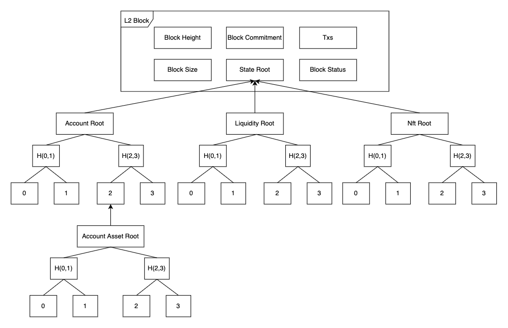

# 저장소 레이아웃
이 문서에서는 ZkBNB의 저장소 레이아웃에 관해 데이터베이스뿐만 아니라 트리 구조의 형태에 대해서도 다룰 예정입니다.

## RDB 레이아웃
RDB 안의 저장소 레이아웃은 다음과 같은 형태로 나타납니다.

### 데이터베이스 테이블 레이아웃
데이터베이스에서는 다음 표의 내용들이 여러 정보를 저장하는데 사용됩니다.

 - `Account`: 계정 관련 정보를 기록합니다
 - `Account History`: 계정 정보의 변경 내역을 기록합니다
 - `Asset`: 자산 관련 정보를 기록합니다
 - `Block Witness`: 생성된 증인(Witness)에 대해 기록합니다
 - `L1 Rollup Tx`: L1에서의 트랜잭션 정보에 관해 기록합니다
 - `L1 Synced Block`: L1에서의 블록 정보를 기록합니다
 - `Compressed Block`: L2 블록에 관한 기타 정보를 기록합니다
 - `Block`: L2 블록 정보를 기록합니다
 - `Pool Tx`: 진행 중이거나 실행 완료되었지만 포장되지 않은(not packed) 트랜잭션 메세지를 기록합니다
 - `L2 NFT`: NFT 관련 정보를 기록합니다
 - `L2 NFT History`: NFT 상태 변경 내역 정보를 기록합니다
 - `Priority Request`: L1에서의 우선 요청 정보를 기록합니다
 - `Proof`: 회로에 인해 생성된 증거 정보를 기록합니다
 - `Sys Config`: 시스템 변수를 저장합니다
 - `Tx`: L2에서의 트랜잭션 정보를 기록합니다
 - `Tx Detail`: L2에서의 자세한 트랜잭션 정보를 기록합니다

## 트리
시스템에는 4가지 종류의 트리가 있습니다.
 - 계정 트리 
 - 계정 자산 트리
 - Nft 트리
 - 물리적 저장소

## 계정 트리
각 계정의 `AccountNameHash`, `PublicKey`, `Nonce`, `CollectionNonce`, `AccountAssetTree.Root()`가 해시로 계산되고 `AccountID`에 대응되는 트리에 기록됩니다. 
각 블록 높이에 계정 상태를 기록하고 저장하는데 사용됩니다. 

## 계정 자산 트리
각 계정은 자산 트리를 관리하는데 각 자산의 `Balance`, `LpAmount`와 `OfferCanceledOrFinalized`는 해시로 계산되고 `AssetID`에 대응되는 트리에 기록됩니다.

## Nft 트리
각 NFT의 `CreatorAccountIndex`, `OwnerAccountIndex`, `NftContentHash`, `NftL1Address`, `NftL1TokenId`, `CreatorTreasuryRate`,`CollectionId`가 해시로 계산되며 `NftIndex`에 대응되는 트리에 가록됩니다.
각 블록 높이에 NFT 상태를 기록하고 저장하는데 사용합니다.

## 물리적 저장소
`ZkBNB`에서 트리 구조는 희박한 머클 트리(Sparse Merkle Tree, SMT) 구조를 갖습니다. 저장 공간을 최대한 최적화하기 위해서 SMT 라이브러리를 도입하였고, 4개 층의 트리 구조를 하나의 레이어로 압축하여 트리의 깊이를 줄이고 더 높은 수준을 달성합니다l. 저장 시 물리적 저장 공간을 사용합니다.

더 자세한 사항은 여기를 참고하세요: <https://github.com/bnb-chain/zkbnb-smt/blob/master/docs/design.md>